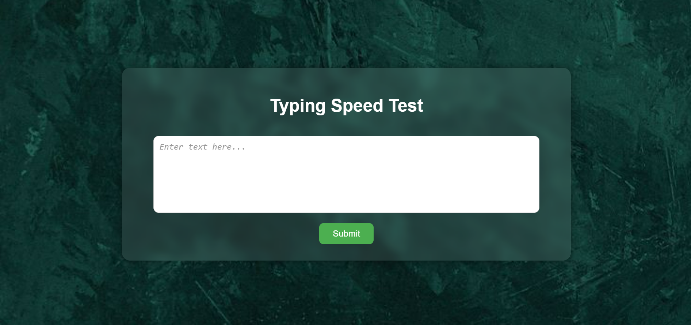

# ⌨️ Typing Speed Test – Python Mini Project

A clean and minimal web app to measure how fast you type.Lightweight, distraction-free design with a transparent typing area over a soft background.Perfect for practicing typing or just testing your speed in seconds.

## 🚀 Features

- Real-time typing timer ⏱️  
- Transparent text area with clean UI 🎨  
- Single-page experience (no redirects) 📄  
- Responsive layout for desktop & mobile 🌐  
- Built with simplicity and performance in mind ⚡

## 🛠️ Tech Stack

- **Frontend**: HTML5, CSS3  
- **Backend**: Python (Flask)

## 📸 Screenshot

💬 *"Type fast. Type smart. Measure your moment."*
